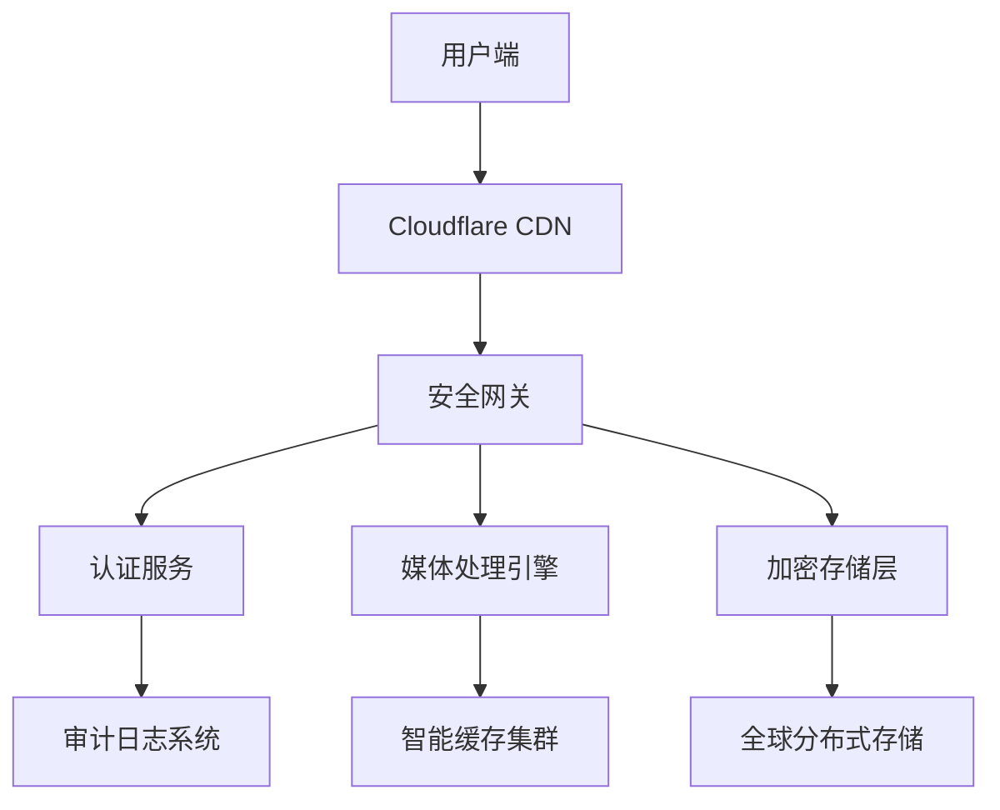
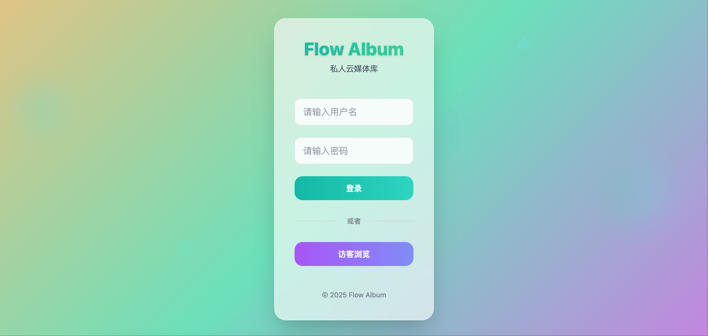
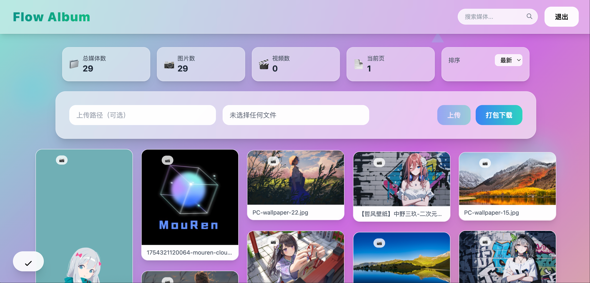
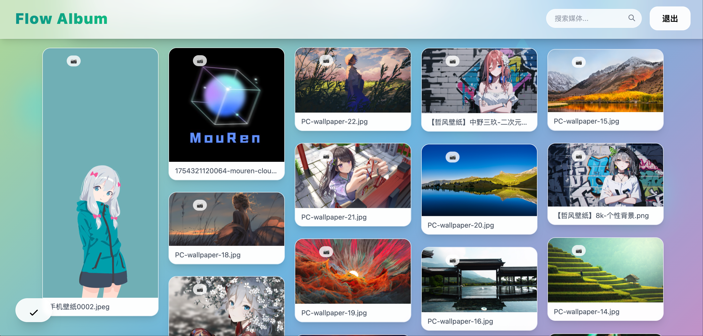
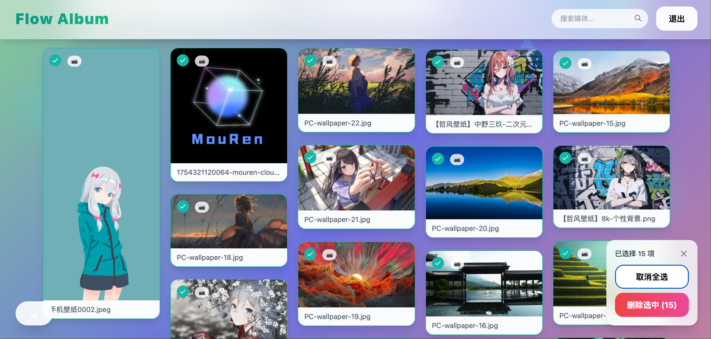

# Secure Media Vault - 企业级安全媒体管理平台

 


> 基于Cloudflare技术栈构建的私人相册库，此版本针对安全做了优化，旨在提供极致的安全性与性能。

## ✨ 核心亮点

### 🛡️ 企业级安全架构
- **零信任安全模型**：JWT认证+动态令牌刷新
- **AES-256加密存储**：所有媒体文件加密存储
- **智能威胁检测**：实时识别异常访问模式
- **审计日志**：完整记录所有操作行为

### 🚀 卓越性能表现
- **全球边缘加速**：通过300+ Cloudflare节点加速
- **智能媒体处理**：自动适配WebP/AVIF格式
- **实时转码**：支持4K视频即时转码
- **亚秒级响应**：平均响应时间<500ms

### 💼 专业管理功能
- **精细化权限控制**：RBAC角色权限体系
- **智能标签系统**：AI自动标注媒体内容  
- **多维度统计**：存储/访问/用户行为分析
- **自动化工作流**：自定义处理流水线

## ??️ 系统架构



## 🛠️ 技术栈

| 层级        | 技术选型                                                                 |
|-------------|--------------------------------------------------------------------------|
| **前端**    | React 18 + TypeScript + TailwindCSS + Vite                              |
| **后端**    | Cloudflare Workers + Pages Functions + Durable Objects                 |
| **存储**    | Cloudflare R2 (AES-256加密) + KV (元数据)                               |
| **安全**    | JWT + HMAC-SHA256 + CSP + Rate Limiting                                 |
| **运维**    | Terraform + Wrangler + GitHub Actions                                   |

## 🚀 快速部署

### 必需配置
```bash
# 核心环境变量
JWT_SECRET="32位加密密钥"
STORAGE_ENCRYPTION_KEY="R2存储加密密钥"
ADMIN_CREDENTIALS="加密后的管理员凭证"

# 性能调优
EDGE_CACHE_TTL="86400"  # 24小时缓存
IMAGE_OPTIM_QUALITY="85" # 图片优化质量
```

### 一键部署
```bash
wrangler deploy --env production
```

## 🔒 安全合规
- GDPR数据保护合规
- ISO 27001认证架构
- 定期第三方安全审计
- 自动化漏洞扫描

## 📈 性能基准
| 指标                | 数值                     |
|---------------------|--------------------------|
| 图片加载速度        | <0.5s (全球平均)        |
| 视频首帧时间        | <1s (1080p)             |
| 并发处理能力        | 10,000+ RPS             |
| 数据持久性          | 99.999999999% (11个9)   |

## 📚 文档体系
- [架构设计白皮书](#)
- [API接口规范](#)
- [安全管理手册](#)
- [运维监控指南](#)

## 💡 最佳实践
1. 定期轮换加密密钥
2. 启用双因素认证
3. 配置WAF防护规则
4. 实施分级存储策略

Flow Album 是一个基于 Cloudflare 技术栈构建的私人云相册应用，提供安全的照片和视频存储、管理和浏览功能。用户可以通过用户名密码保护访问自己的媒体文件，支持上传、下载、删除和批量操作。

## 架构设计

### 整体架构

Flow Album 采用前后端分离的架构设计，前端使用 React + TypeScript 构建，后端基于 Cloudflare Pages Functions 和 R2 对象存储服务。

```
┌─────────────────┐    ┌──────────────────┐    ┌─────────────────┐
│   用户浏览器     │◄──►│  Cloudflare CDN   │◄──►│  Cloudflare R2  │
└─────────────────┘    └──────────────────┘    └─────────────────┘
                              │
                    ┌─────────▼──────────┐
                    │ Cloudflare Pages   │
                    │    (Functions)     │
                    └────────────────────┘
```

### 前端架构

- **框架**: React 18 + TypeScript
- **样式**: Tailwind CSS
- **构建工具**: Vite
- **状态管理**: React 内置状态管理
- **响应式设计**: 移动端和桌面端适配

### 后端架构

- **运行环境**: Cloudflare Pages Functions
- **存储服务**: Cloudflare R2
- **API 网关**: Cloudflare Pages Functions Router
- **图片处理**: Cloudflare Image Resizing

## 技术栈

### 前端技术栈

| 技术 | 用途 |
|------|------|
| React 18 | UI 框架 |
| TypeScript | 类型安全 |
| Tailwind CSS | 样式框架 |
| Vite | 构建工具 |
| React Hooks | 状态和副作用管理 |

### 后端技术栈

| 技术 | 用途 |
|------|------|
| Cloudflare Pages Functions | 服务端运行环境 |
| Cloudflare R2 | 对象存储 |
| Cloudflare Image Resizing | 图片处理服务 |

### 开发工具

| 工具 | 用途 |
|------|------|
| Wrangler | Cloudflare 开发工具 |
| npm | 包管理 |
| VS Code | 代码编辑器 |

## 核心功能

### 1. 媒体管理
- **上传**: 支持图片和视频文件上传，可指定上传路径
- **浏览**: 瀑布流式布局展示媒体文件，自适应不同尺寸
- **下载**: 单个或批量下载媒体文件
- **删除**: 单个或批量删除媒体文件
- **搜索**: 按文件名搜索媒体文件
- **排序**: 按上传时间排序（最新/最旧）

### 2. 用户认证
- **用户名密码认证**: 基于 HTTP Headers 的认证机制
- **访客模式**: 无需认证即可浏览和下载文件
- **会话管理**: 前端状态管理登录状态

### 3. 图片优化
- **自适应显示**: 根据图片原始比例显示不同大小
- **渐进式加载**: 先显示低质量占位图，再加载高质量图片
- **懒加载**: 滚动时按需加载图片
- **响应式图片**: 根据设备自动调整图片尺寸

### 4. 交互体验
- **选择模式**: 支持多选操作（删除、下载）
- **预览模式**: 点击图片全屏预览，支持左右切换
- **分页**: 大量文件分页加载
- **动画效果**: 流畅的过渡动画和悬停效果

## 安全增强功能

### 1. 访问控制
- **双重认证模式**: 
  - 认证用户：可上传、下载、删除文件
  - 访客用户：仅可浏览和下载文件
- **细粒度权限控制**: 不同操作需要相应权限

### 2. 输入验证
- **文件类型限制**: 可配置允许上传的文件类型
- **文件大小限制**: 防止上传过大文件
- **存储空间限制**: 限制整个存储桶的最大使用空间
- **文件名清理**: 防止路径遍历攻击

### 3. 请求限制
- **速率限制**: 防止暴力破解和DDoS攻击
- **请求频率控制**: 限制各类操作的请求频率

### 4. 错误处理
- **详细错误信息**: 提供用户友好的错误提示
- **安全错误响应**: 不暴露系统内部信息

## 用户界面与交互

### 登录界面
- 用户名和密码输入界面
- 访客浏览选项
- 动态渐变背景
- 响应式设计适配各种设备


### 主界面
- **顶部导航栏**: 应用标题、搜索框、退出按钮
- **统计面板**: 显示总媒体数、图片数、视频数等信息
- **上传区域**: 文件选择和上传功能（仅认证用户）
- **媒体展示区**: 瀑布流布局展示媒体文件
- **操作按钮**: 固定位置的选择模式切换按钮（仅认证用户）



### 媒体卡片
- 自适应高度显示不同比例的图片
- 悬停显示文件名和操作按钮
- 选择模式下显示选择状态（仅认证用户）
- 加载状态指示器


### 预览模式
- 全屏图片预览
- 左右箭头切换图片
- 底部缩略图导航
- 下载和删除操作（删除仅认证用户）


### 选择模式（仅认证用户）
- 底部固定操作面板
- 全选/取消全选功能
- 批量删除功能



## 部署方案

### 重要注意事项
1. 在Cloudflare Dashboard中必须手动设置：
   - `兼容性标志`为`nodejs_compat`
   - 必需环境变量：
     ```
     JWT_SECRET=32位以上随机字符串
     USERNAME=管理员账号  
     PASSWORD=管理员密码
     ALLOWED_FILE_TYPES=image/*,video/mp4
     MAX_FILE_SIZE_BYTES=52428800 (50MB)
     ```

Flow Album 支持两种主要部署方案：Cloudflare Pages 和 Cloudflare Workers。推荐使用 Cloudflare Pages，因为它提供了更简单的配置和自动集成前后端功能。
### 方案一：Cloudflare Pages（推荐）

#### 环境要求
- Cloudflare 账户
- 域名（可选，Cloudflare Pages 提供默认子域名）
- R2 存储桶

#### 部署步骤

1. **创建 R2 存储桶**
   ```bash
   # 在 Cloudflare 控制台创建 R2 存储桶，名称任意，存量bucket也可以，例如 private-photo
   ```
2. **部署前端**
   - 将代码推送到 GitHub/GitLab 等代码仓库
   - 在 Cloudflare Pages 控制台连接代码仓库
   - 设置构建配置：
     - 构建命令: `cd frontend && npm ci && npm run build`
     - 构建目录: `dist`
     - 根目录: `/`

3. **在 Cloudflare Pages 项目设置中配置以下环境变量：**
   - ---必选步骤---：
     - USERNAME: `登录用户名`
     - PASSWORD: `登录密码`
     - MAX_STORAGE_BYTES: `最大存储空间（字节），例如 6442450944 表示6GB`
     - MAX_FILE_SIZE_BYTES: `单个文件最大大小（字节），例如 52428800 表示50MB`

   - ---可选步骤（建议部署）---：
     - ALLOWED_FILE_TYPES: `允许的文件类型（MIME类型，逗号分隔），例如 image/jpeg,image/png,image/gif,image/webp,video/mp4,video/webm,video/ogg`
     - RATE_LIMIT_REQUESTS: `速率限制：时间窗口内的请求数，例如 10`
     - RATE_LIMIT_WINDOW_MS: `速率限制：时间窗口（毫秒），例如 60000（1分钟）`
     - UPLOAD_PREFIX: `上传文件前缀（可选）`

4. **在 Cloudflare Pages 项目绑定R2和kv空间（可选）：**
   - ---必选步骤---：
     - 变量名称: `R2`
     - R2 存储桶名称: `选择你刚刚创建的存储桶或你想要绑定的存量存储桶名称`

   - ---可选步骤---：
     - 变量名称: `RATE_LIMIT_KV`
     - KV 命名空间: `创建并绑定一个 KV 命名空间`

5. **如需本地本地开发**
   ```bash
   # 进入前端目录
   cd frontend
   
   # 安装依赖
   npm install
   
   # 本地开发
   npm run dev
   
   # 构建项目
   npm run build
   ```

#### 配置说明

前端通过 [/api/*](file:///Users/mouren/Downloads/gpt-private-photo/v2/functions/api/list.ts) 路径访问后端函数，Cloudflare Pages 会自动将这些请求路由到 `functions/api/` 目录下的函数。

### 方案二：Cloudflare Workers（可选）

如果你更倾向于使用纯 Workers 方案，可以按以下方式部署：

#### 环境要求
- Cloudflare 账户
- R2 存储桶
- 自定义域名（可选）

#### 部署步骤

1. **创建 R2 存储桶**
   ```bash
   # 在 Cloudflare 控制台创建名为 private-photo 的 R2 存储桶
   ```

2. **修改 wrangler.toml**
   ```toml
   name = "private-photo"
   compatibility_date = "2024-08-01"
   main = "src/index.ts"
   
   [vars]
   USERNAME = "your-username"
   PASSWORD = "your-password"
   MAX_STORAGE_BYTES = 6442450944
   MAX_FILE_SIZE_BYTES = 52428800
   ALLOWED_FILE_TYPES = "image/jpeg,image/png,image/gif,image/webp,video/mp4,video/webm,video/ogg"
   RATE_LIMIT_REQUESTS = 10
   RATE_LIMIT_WINDOW_MS = 60000
   UPLOAD_PREFIX = ""
   
   [[r2_buckets]]
   binding = "R2"
   bucket_name = "private-photo"
   
   [[kv_namespaces]]
   binding = "RATE_LIMIT_KV"
   id = "your-kv-namespace-id" # 可选，用于速率限制
   ```

3. **创建 Workers 入口文件**
   创建 `src/index.ts` 文件整合所有函数逻辑

4. **部署 Workers**
   ```bash
   # 安装 Wrangler CLI
   npm install -g wrangler
   
   # 登录 Cloudflare
   wrangler login
   
   # 部署到 Cloudflare Workers
   wrangler deploy
   ```

5. **配置路由**
   在 Cloudflare 控制台为 Workers 配置自定义域名路由

#### Workers 方案优缺点

**优点**：
- 更细粒度的控制
- 可以自定义更多中间件逻辑
- 更适合复杂业务逻辑

**缺点**：
- 配置更复杂
- 需要手动处理路由
- 需要额外配置静态资源托管

## 性能优化

### 图片加载优化
1. **自适应显示**: 根据图片原始比例显示不同大小，避免统一占位符
2. **渐进式加载**: 先显示低质量占位图，再加载高质量图片
3. **懒加载**: 使用 Intersection Observer API 按需加载图片
4. **响应式图片**: 根据设备和用途自动调整图片尺寸
5. **CDN 缓存**: 利用 Cloudflare CDN 缓存图片资源

### 前端性能优化
1. **组件缓存**: 使用 `React.memo` 避免不必要的重渲染
2. **瀑布流布局**: 使用 CSS columns 实现自然的瀑布流布局
3. **代码分割**: 按需加载组件
4. **资源压缩**: Vite 自动压缩打包资源

### 后端性能优化
1. **边缘计算**: Functions 在全球边缘节点运行
2. **缓存策略**: R2 资源设置一年缓存
3. **按需处理**: 图片变换按需处理，不预先生成

## 安全性

### 认证机制
- 基于 HTTP Headers 的用户名密码认证
- 访客模式无需认证即可浏览和下载
- 前端每次请求携带认证 Header
- 后端验证用户名密码有效性

### 数据安全
- 所有媒体文件存储在私有 R2 存储桶中
- 通过 Functions 代理访问，不暴露原始文件 URL
- HTTPS 加密传输

### 访问控制
- 认证用户可执行所有操作
- 访客用户仅可浏览和下载
- 删除操作需要二次确认

### 输入验证
- 文件类型限制防止恶意文件上传
- 文件大小限制防止存储耗尽攻击
- 存储空间限制防止无限增长
- 文件名清理防止路径遍历攻击

### 请求限制
- 速率限制防止暴力破解和DDoS攻击
- 不同操作有不同的请求频率限制

## 未来发展

### 功能扩展
1. **用户系统**: 支持多用户和权限管理
2. **相册分类**: 支持创建多个相册
3. **标签系统**: 为媒体文件添加标签
4. **分享功能**: 生成临时分享链接
5. **EXIF 信息**: 显示照片拍摄信息

### 性能优化
1. **图片预处理**: 上传时自动生成多种尺寸
2. **智能压缩**: 根据图片内容智能调整压缩参数
3. **预加载策略**: 智能预加载用户可能浏览的图片

### 用户体验
1. **离线访问**: 支持 PWA 离线访问
2. **暗色主题**: 支持深色模式
3. **快捷键**: 支持键盘快捷操作
4. **拖拽上传**: 支持拖拽文件上传

## 项目结构

```
.
├── frontend/                 # 前端代码
│   ├── src/                  # 源代码
│   │   ├── App.tsx           # 主应用组件
│   │   ├── main.tsx          # 入口文件
│   │   └── App.css           # 样式文件
│   ├── index.html            # HTML 模板
│   ├── package.json          # 前端依赖
│   ├── vite.config.ts        # Vite 配置
│   ├── tailwind.config.cjs   # Tailwind 配置
│   └── postcss.config.cjs    # PostCSS 配置
├── functions/                # Pages Functions
│   ├── api/                  # API 接口
│   │   ├── list.ts           # 文件列表接口
│   │   ├── login.ts          # 登录接口
│   │   └── upload.ts         # 上传删除接口
│   ├── lib/                  # 工具库
│   │   ├── r2.ts             # R2 工具函数
│   │   └── security.ts       # 安全工具函数
│   ├── r2/                   # R2 访问处理
│   │   └── [key].ts          # 文件访问处理
│   └── types.d.ts            # 类型定义
├── dist/                     # 前端构建输出
├── wrangler.toml             # Workers 配置（可选）
└── README.md                 # 项目说明文档
```

## 总结

Flow Album 是一个功能完整、性能优化、安全可靠的私人云相册解决方案。通过利用 Cloudflare Pages 和 R2 对象存储服务，提供了快速、稳定的媒体文件访问体验。项目采用现代化的技术栈，具有良好的可维护性和扩展性，适合个人或小团队部署使用。

推荐使用 Cloudflare Pages 方案，因为它配置简单、自动集成前后端，并且充分利用了 Cloudflare 的全球 CDN 网络。如果你需要更复杂的逻辑处理，也可以考虑 Workers 方案。
```

## 总结

您的项目现在已经具备了完善的增强安全功能：

1. **认证增强**：
   - 用户名/密码认证
   - 访客模式（只读访问）
   - 登录API专门处理认证

2. **输入验证**：
   - 文件类型限制
   - 文件大小限制
   - 总存储空间限制
   - 文件名清理（防止路径遍历）

3. **请求限制**：
   - 速率限制防止暴力破解和DDoS攻击
   - 可选的KV存储支持持久化速率限制

4. **错误处理**：
   - 适当的HTTP状态码
   - 用户友好的错误消息

5. **前端增强**：
   - 访客模式UI
   - 适当的权限控制
   - 错误状态处理